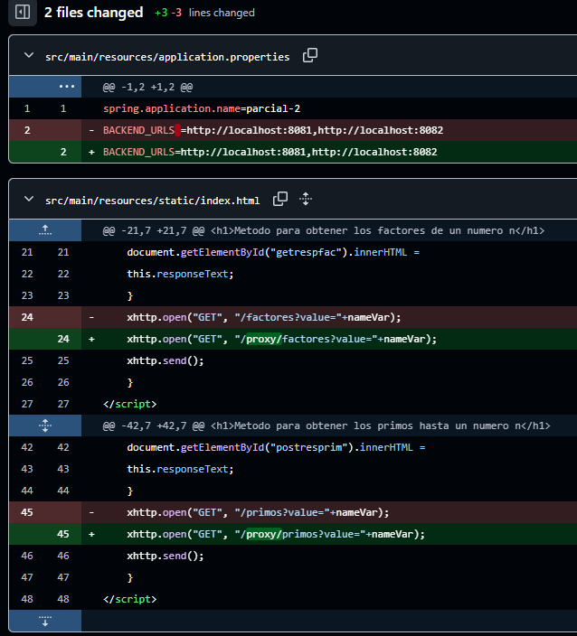

# parcial2-AREP

## Trabajo hecho en clase:
Actualmente tengo todo el codigo funcional a nivel local, falta el despliegue que por temas de tiempo no se alcanzo a realizar debido a que el computador se tarda demasiado cuando pongo los comandos ``mvn package`` o ``mvn install``. Se adjuntan evidencias del trabajo hecho y de la lentitud del computador (videos en la carpeta resources).

En uno de los videos se muestra el trabajo en clase y en el otro pruebas de de que el computador cuando se necesita usar comandos iba demasiado lento lo que llevo a que tuviera dificultades para poder conectarme a las instancias para pasar el ``JAR`` y poder realizar el despliegue. Aun asi las instancias ya fueron creadas con sus grupos de seguridad correctamente configurados por lo que no deberia existir ningun problema a la hora de desplegar mas alla de cambiar las rutas del backend para que en vez de apuntar de localhost apunte a la ip publica de cada una de las dos instancias donde estan los math service. 

Link video trabajo: https://youtu.be/yl3qBT--plo

Link video evidencia lentitud: https://youtu.be/ZNh1k_EaKmU

## Trabajo hecho fuera de clase:

Adjunto video e imagen como evidencia de lo que se trabajo por fuera de clase, como usted puede observar son cambios infimos a nivel de codigo y el despliegue que como ya se dijo arriba no se logro en el tiempo establecido gracias al pesimo computador en el que me toco presentarlo. Se entiende que al ser trabajo por fuera no valga lo mismo que lo que si se hizo en clase pero de todas maneras se dejan las pruebas de que el trabajo era completamente funcional y perfectamente se podria haber logrado hacer en clase.

**Cambios hechos a nivel de codigo fuera del espacio establecido:**

**Video de evidencia del despliegue:**

Link video : https://youtu.be/Nup-WIzbVWY
